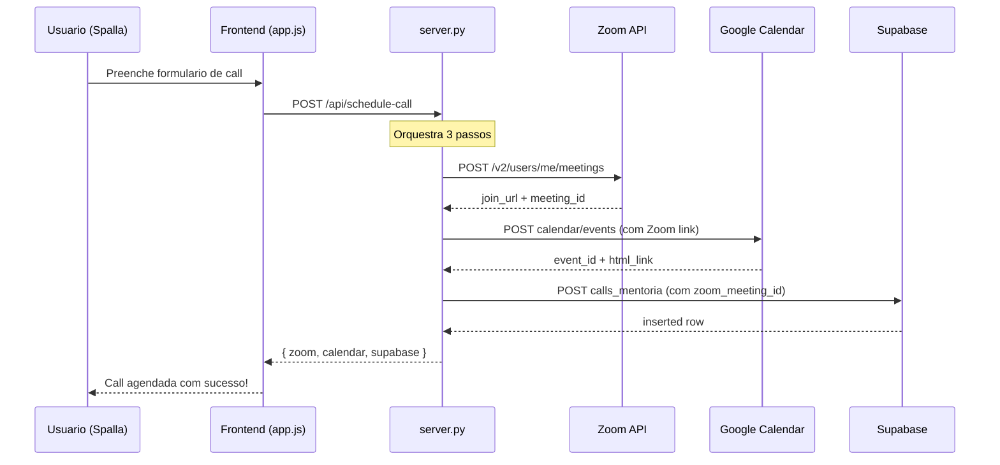
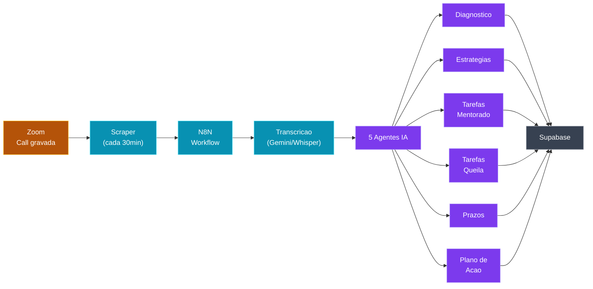

# Spalla V2 — Mapa Completo do Sistema

Cole no [mermaid.live](https://mermaid.live) para visualizar.

---

## Contexto rapido

**Atualizado em 17/02/2026.**

A **Queila** e mentora de **37 mentorados ativos** (29 N1 + 8 N2) no programa CASE. Cada mentorado tem:
- Calls individuais gravadas no Zoom (com transcricao)
- Grupo de WhatsApp individual com a equipe
- Participacao em sessoes de grupo (conselhos, QAs, aulas)
- Tarefas combinadas, direcionamentos da Queila, marcos atingidos

Toda vez que alguem grava uma call, um **sistema automatico (workflow N8N)** processa a transcricao com **5 agentes de IA** que extraem: diagnostico do mentorado, estrategias, tarefas do mentorado, tarefas da Queila, e prazos. Isso gera um **plano de acao** por call.

O WhatsApp e coletado por um scraper continuo (Evolution API) + imports manuais.

Tudo isso ja esta no banco (Supabase). As **God Views** sao views SQL enxutas que consolidam os dados **acionaveis** para a Spalla consumir. Sem ruido, sem colunas que ninguem vai olhar.

**Importante:** Existem ~20 mentorados "tese" (pesquisa academica) e 5 inativos no banco (Karine Canabrava e Leticia Oliveira por reembolso, Flavia Nantes por finalizacao + duplicatas merged). Todos sao **automaticamente filtrados** em todas as views — nunca aparecem no dashboard.

---

## Diagrama 1 — Arquitetura Geral (Frontend + Backend + Banco + APIs)

```mermaid
flowchart TB

%% =============================================
%% USUARIO
%% =============================================
subgraph USUARIO["USUARIO (Navegador)"]
  direction LR
  AUTH["<b>Login</b><br/>Senha: spalla2026<br/>localStorage"]
end

%% =============================================
%% FRONTEND
%% =============================================
subgraph FRONTEND["FRONTEND — Alpine.js SPA"]
  direction LR

  subgraph PAGES["8 Paginas"]
    direction TB
    P1["<b>Dashboard</b><br/>Cards de 37 mentorados<br/>Filtros + Busca + KPIs"]
    P2["<b>Detalhe</b><br/>Perfil completo<br/>6 tabs (Resumo, IA,<br/>Tarefas, Calls,<br/>Docs, WhatsApp)"]
    P3["<b>Kanban</b><br/>Board por fase"]
    P4["<b>Tarefas</b><br/>Board + List + Gantt<br/>3 Spaces (ClickUp)"]
    P5["<b>Agenda</b><br/>Calendario + Agendar<br/>calls (Zoom+Calendar)"]
    P6["<b>WhatsApp</b><br/>Chat integrado<br/>via Evolution API"]
    P7["<b>Dossies</b><br/>Pipeline de status<br/>(dados estaticos)"]
    P8["<b>Lembretes</b><br/>Notificacoes manuais<br/>(localStorage)"]
  end

  subgraph STATIC["Dados Estaticos (data.js)"]
    direction TB
    S1["Instagram Profiles<br/>(40+ perfis)"]
    S2["Dossier Pipeline<br/>(63 mentorados)"]
    S3["Calls Fallback<br/>(100+ calls)"]
    S4["Google Drive Links"]
  end

  subgraph FILES["Arquivos"]
    direction TB
    F1["index.html (129KB)"]
    F2["app.js (77KB)"]
    F3["data.js (146KB)"]
    F4["styles.css (130KB)"]
    F5["photos/ (50+ JPGs)"]
  end
end

%% =============================================
%% BACKEND
%% =============================================
subgraph BACKEND["BACKEND — server.py (Python HTTP, porta 8888)"]
  direction LR

  subgraph ENDPOINTS["7 Endpoints"]
    direction TB
    E1["<b>POST /api/schedule-call</b><br/>Orquestra: Zoom + Calendar + DB"]
    E2["<b>POST /api/zoom/create-meeting</b>"]
    E3["<b>POST /api/calendar/create-event</b>"]
    E4["<b>GET /api/mentees</b>"]
    E5["<b>GET /api/calendar/events</b>"]
    E6["<b>GET /api/calls/upcoming</b>"]
    E7["<b>GET/POST /api/evolution/*</b><br/>Proxy transparente"]
  end
end

%% =============================================
%% SUPABASE
%% =============================================
subgraph SUPABASE["SUPABASE — knusqfbvhsqworzyhvip"]
  direction TB

  subgraph VIEWS_MAIN["Views Principais (frontend chama direto)"]
    direction LR
    V1["<b>vw_god_overview</b><br/>37 mentorados<br/>24 colunas cada"]
    V2["<b>vw_god_tasks_full</b><br/>~800 tarefas<br/>com JSON aggregates"]
    V3["<b>vw_god_cohort</b><br/>KPIs por fase<br/>5 rows"]
  end

  subgraph VIEWS_AUX["Views de Apoio"]
    direction LR
    VA1["<b>vw_god_calls</b><br/>211 calls + analise"]
    VA2["<b>vw_god_contexto_ia</b><br/>37 ultimos outputs IA"]
    VA3["<b>vw_god_pendencias</b><br/>413 msgs pendentes"]
    VA4["<b>vw_god_direcionamentos</b><br/>1.673 orientacoes"]
    VA5["<b>vw_god_vendas</b><br/>37 pipelines"]
    VA6["<b>vw_god_timeline</b><br/>~2K eventos"]
    VA7["<b>vw_god_tarefas</b><br/>804+ tarefas (4 fontes)"]
  end

  subgraph FUNCTIONS["Functions RPC"]
    direction LR
    FN1["<b>fn_god_mentorado_deep(id)</b><br/>JSON com 9 secoes"]
    FN2["<b>fn_god_alerts()</b><br/>474 alertas priorizados"]
  end

  subgraph TABLES["17 Tabelas"]
    direction LR
    T1["mentorados (62)"]
    T2["calls_mentoria (226)"]
    T3["analises_call (~260)"]
    T4["interacoes_mentoria (23.8K)"]
    T5["extracoes_agente (505)"]
    T6["documentos_plano_acao (93)"]
    T7["direcionamentos (1.362)"]
    T8["tarefas_acordadas (9)"]
    T9["tarefas_equipe (264)"]
    T10["marcos_mentorado (~104)"]
    T11["travas_bloqueios"]
    T12["metricas_mentorado"]
    T13["god_tasks (~800) RW"]
    T14["god_task_subtasks"]
    T15["god_task_comments"]
    T16["god_task_checklist"]
    T17["god_task_handoffs"]
  end
end

%% =============================================
%% APIS EXTERNAS
%% =============================================
subgraph APIS["APIS EXTERNAS"]
  direction LR
  API1["<b>Zoom API</b><br/>Server-to-Server OAuth<br/>Criar reunioes<br/>Gravacao automatica"]
  API2["<b>Google Calendar</b><br/>Service Account<br/>Criar/listar eventos"]
  API3["<b>Evolution API</b><br/>WhatsApp proxy<br/>Chats + mensagens<br/>+ fotos de perfil"]
end

%% =============================================
%% FONTES DE DADOS
%% =============================================
subgraph ORIGEM["FONTES ORIGINAIS DE DADOS"]
  direction LR
  O1["<b>Zoom Scraper</b><br/>Busca calls a cada<br/>30 min automatico"]
  O2["<b>5 Agentes IA</b><br/>Processam cada<br/>transcricao: diagnostico,<br/>estrategias, tarefas,<br/>prazos"]
  O3["<b>WhatsApp Scraper</b><br/>Evolution API contínuo<br/>+ imports ZIP manuais"]
  O4["<b>Equipe CASE</b><br/>Queila, Lara, Jennifer,<br/>Kaique registram<br/>tarefas, marcos, vendas"]
  O5["<b>N8N Workflows</b><br/>Orquestram todo o<br/>pipeline automatico"]
end

%% =============================================
%% CONEXOES: Usuario → Frontend
%% =============================================
AUTH --> PAGES

%% CONEXOES: Frontend → Supabase (direto via SDK JS)
P1 --> V1
P1 --> V3
P1 --> FN2
P2 --> FN1
P2 --> VA1
P2 --> VA2
P2 --> VA4
P3 --> V1
P4 --> V2
P4 --"ESCRITA"--> T13

%% CONEXOES: Frontend → Backend
P5 --> E1
P6 --> E7

%% CONEXOES: Backend → APIs Externas
E1 --> API1
E1 --> API2
E1 --"salva call"--> T2
E2 --> API1
E3 --> API2
E4 --> T1
E5 --> API2
E6 --> T2
E7 --> API3

%% CONEXOES: Views → Tabelas
V1 --> T1
V1 --> T4
V1 --> T2
V2 --> T13
V2 --> T14
V2 --> T15
V2 --> T16
V2 --> T17

VA1 --> T2
VA1 --> T3
VA2 --> T5
VA2 --> T6
VA3 --> T4
VA4 --> T7
VA4 --> T3
VA4 --> T5
VA5 --> T1
VA5 --> T12
VA6 --> T2
VA6 --> T10
VA6 --> T7
VA6 --> T6
VA7 --> T8
VA7 --> T9
VA7 --> T3
VA7 --> T6

FN1 --> VA1
FN1 --> VA2
FN1 --> VA4
FN1 --> VA7
FN1 --> T1
FN1 --> T4
FN1 --> T10
FN1 --> T11

FN2 --> VA3
FN2 --> V1

%% CONEXOES: Fontes → Tabelas
O1 --> T2
O1 --> T3
O2 --> T5
O2 --> T6
O3 --> T4
O4 --> T8
O4 --> T9
O4 --> T7
O4 --> T10
O4 --> T12
O5 --> O1
O5 --> O2

%% =============================================
%% ESTILOS
%% =============================================
classDef usuario fill:#6d28d9,stroke:#a78bfa,color:#fff,stroke-width:2px
classDef front fill:#7c3aed,stroke:#a78bfa,color:#fff,stroke-width:2px
classDef backend fill:#0d9488,stroke:#5eead4,color:#fff,stroke-width:2px
classDef view fill:#2563eb,stroke:#60a5fa,color:#fff,stroke-width:2px
classDef func fill:#0891b2,stroke:#67e8f9,color:#fff,stroke-width:2px
classDef tabela fill:#374151,stroke:#9ca3af,color:#fff,stroke-width:1px
classDef api fill:#dc2626,stroke:#f87171,color:#fff,stroke-width:2px
classDef origem fill:#b45309,stroke:#fbbf24,color:#fff,stroke-width:2px
classDef static fill:#4338ca,stroke:#818cf8,color:#fff,stroke-width:1px

class AUTH usuario
class P1,P2,P3,P4,P5,P6,P7,P8 front
class F1,F2,F3,F4,F5 front
class S1,S2,S3,S4 static
class E1,E2,E3,E4,E5,E6,E7 backend
class V1,V2,V3,VA1,VA2,VA3,VA4,VA5,VA6,VA7 view
class FN1,FN2 func
class T1,T2,T3,T4,T5,T6,T7,T8,T9,T10,T11,T12,T13,T14,T15,T16,T17 tabela
class API1,API2,API3 api
class O1,O2,O3,O4,O5 origem
```

---

## Diagrama 2 — Fluxo de Agendamento de Call

---

## Diagrama 3 — Fluxo de Processamento de Call (Pipeline Automatico)

---

## Como ler

**Diagrama 1 (Arquitetura Geral):** Le de cima pra baixo:

| Camada | Cor | O que e |
|--------|-----|---------|
| **Usuario** (roxo escuro) | Login + navegacao | Quem usa o sistema |
| **Frontend** (roxo) | Alpine.js SPA | 8 paginas + dados estaticos + fotos |
| **Backend** (teal) | server.py | 7 endpoints que proxeiam APIs externas |
| **Supabase** (azul/cinza) | Banco de dados | 17 tabelas + 9 views + 2 functions |
| **APIs Externas** (vermelho) | Zoom, Calendar, WhatsApp | Integracoes de terceiros |
| **Fontes de Dados** (laranja) | Scrapers, IA, equipe manual | De onde os dados vem originalmente |

**Setas solidas** = dependencia principal
**Setas tracejadas** = dados opcionais/enriquecimento

**Dois caminhos de dados:**
1. **Frontend → Supabase (direto):** SDK JS no browser, leitura de views/functions + escrita em god_tasks
2. **Frontend → server.py → APIs:** Agendamento (Zoom + Calendar), WhatsApp (Evolution API proxy)

---

## O ponto-chave

O banco ja tem tudo (**29 mil+ registros** de diversas fontes, incluindo ~800 god_tasks). As **God Views** sao a camada intermediaria que:
1. **Junta** dados de 17 tabelas diferentes
2. **Calcula** prioridades, horas pendentes, % de meta, alertas, etc.
3. **Filtra** automaticamente mentorados tese e inativos
4. **Entrega** tudo pronto pro frontend — e so chamar `sb.from('nome_da_view').select('*')`

O **server.py** cuida apenas das integracoes externas (Zoom, Calendar, WhatsApp) que precisam de credenciais sensíveis no backend.

As views sao **read-only**, exceto `god_tasks` que e uma tabela bidirecional (o frontend le e escreve direto).
