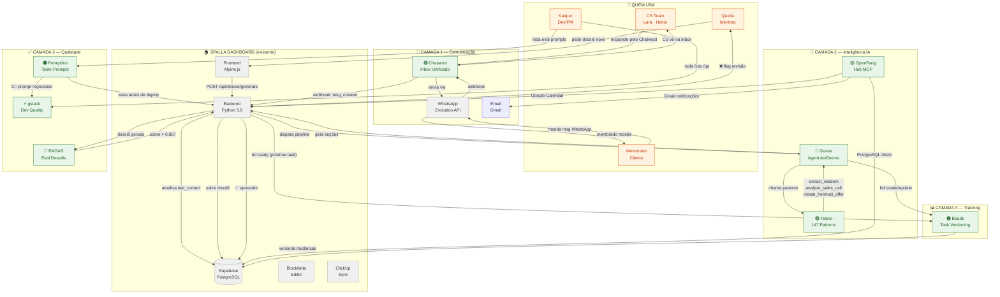
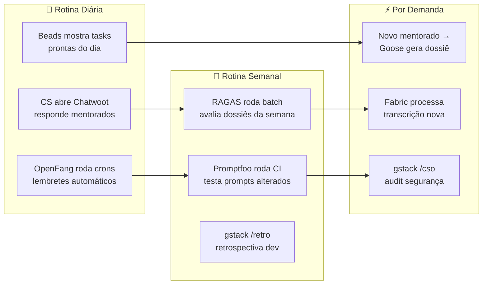

# Plano de Integração — 8 Ferramentas Externas no Spalla

## Mapa Geral de Uso (quem usa o quê, quando, por quê)

## Mapa de Uso Diário (para não esquecer nenhuma ferramenta)

---

## EPIC 1 — Chatwoot: Inbox Unificado WhatsApp + Email

**Objetivo**: CS team (Lara, Heitor) responde mentorados por uma inbox centralizada em vez de WhatsApp Web individual. Histórico de conversa salvo, buscável, com contexto do mentorado visível.

**Gatilho de uso**: Toda vez que um mentorado manda mensagem. Diário.
**Quem usa**: CS Team, Queila (escalações), Kaique (analytics).

### Stories

#### 1.1 — Deploy Chatwoot self-hosted
- **Tarefa**: Subir Chatwoot via Docker no Railway ou VPS dedicado
- **AC**: Chatwoot rodando em `chat.spalla.app` com login funcionando
- **Subtarefas**:
  - [ ] Docker Compose com PostgreSQL + Redis + Chatwoot
  - [ ] Configurar domínio + SSL (Let's Encrypt)
  - [ ] Criar conta admin + contas dos agentes (Lara, Heitor, Queila, Kaique)
  - [ ] Configurar timezone BRT e idioma pt-BR
- **Estimativa**: 1 dia
- **Não quebra**: Nenhum arquivo do Spalla é alterado

#### 1.2 — Conectar WhatsApp ao Chatwoot
- **Tarefa**: Integrar canal WhatsApp Business (via Cloud API ou Evolution API bridge)
- **AC**: Mensagens do WhatsApp aparecem na inbox do Chatwoot, respostas voltam pro mentorado
- **Subtarefas**:
  - [ ] Configurar WhatsApp Cloud API inbox OU bridge Evolution→Chatwoot
  - [ ] Testar envio/recebimento com número de teste
  - [ ] Mapear fluxo: mentorado→WhatsApp→Chatwoot→agente→WhatsApp→mentorado
  - [ ] Configurar assignment rules (novos mentorados → CS team)
- **Estimativa**: 1 dia

#### 1.3 — Webhook Chatwoot → Spalla Backend
- **Tarefa**: Criar endpoint `POST /api/webhooks/chatwoot` no backend Python que recebe eventos
- **AC**: Quando mensagem é criada no Chatwoot, `last_contact` do mentorado atualiza no Supabase
- **Subtarefas**:
  - [ ] Endpoint no `14-APP-server.py` que valida signature HMAC-SHA256
  - [ ] Handler para `message_created`: busca mentorado por telefone, atualiza `last_contact`
  - [ ] Handler para `conversation_status_changed`: log de atividade
  - [ ] Configurar webhook no Chatwoot apontando pro Railway
- **Estimativa**: 0.5 dia

#### 1.4 — Custom Attributes no Chatwoot sincronizados com Supabase
- **Tarefa**: Quando CS abre conversa, ver dados do mentorado direto no Chatwoot
- **AC**: Sidebar do Chatwoot mostra: status dossiê, etapa onboarding, contrato assinado
- **Subtarefas**:
  - [ ] Criar custom attributes no Chatwoot: `dossie_status`, `onboarding_stage`, `contrato`
  - [ ] Script Python que sincroniza Supabase→Chatwoot contacts (cron 1x/hora)
  - [ ] Testar que atualização no Spalla reflete no Chatwoot
- **Estimativa**: 0.5 dia

#### 1.5 — Automations: assignment + labels automáticos
- **Tarefa**: Regras automáticas para rotear conversas
- **AC**: Novos mentorados vão pra CS Team, label `onboarding` adicionado automaticamente
- **Subtarefas**:
  - [ ] Rule: nova conversa + contato sem label → label `novo-mentorado`
  - [ ] Rule: conversa com keyword `pagamento` → label `financeiro` + assign Kaique
  - [ ] Rule: conversa sem resposta 24h → label `urgente`
  - [ ] Canned responses: 5 respostas padrão (boas-vindas, lembrete call, docs pendentes)
- **Estimativa**: 0.5 dia

---

## EPIC 2 — Fabric: Patterns de IA para Dossiês e Análises

**Objetivo**: Ter uma biblioteca de prompts reutilizáveis e versionados para processar transcrições, gerar seções de dossiê, e analisar calls. Substitui prompts ad-hoc por patterns testados.

**Gatilho de uso**: Toda vez que precisa processar texto com IA (dossiê, transcrição, análise). Semanal.
**Quem usa**: Kaique (operação), Pipeline automático (Goose/n8n).

### Stories

#### 2.1 — Instalar Fabric e configurar provider
- **Tarefa**: Instalar Fabric CLI, configurar Anthropic como provider padrão
- **AC**: `fabric -p summarize < test.txt` retorna resultado com Claude
- **Subtarefas**:
  - [ ] `brew install fabric` (ou Go build)
  - [ ] `fabric --setup` → configurar API key Anthropic
  - [ ] Testar com pattern `summarize` em transcrição real
  - [ ] Configurar modelo padrão: `claude-sonnet-4-6` (custo-benefício)
- **Estimativa**: 0.5 dia

#### 2.2 — Criar 5 Custom Patterns CASE
- **Tarefa**: Patterns específicos da metodologia CASE em `~/.config/fabric/patterns/`
- **AC**: 5 patterns testados que geram output na voz da Queila
- **Patterns**:
  - [ ] `case_extract_oferta` — Extrai dados de oferta de transcrição (público, tese, pilares, ROI)
  - [ ] `case_extract_posicionamento` — Extrai posicionamento (bio, destaques, DECDI, tom de voz)
  - [ ] `case_extract_funil` — Extrai estratégia de funil (tipo, etapas, scripts, follow-ups)
  - [ ] `case_analyze_call` — Analisa call de vendas/qualificação (objeções, sinais, próximos passos)
  - [ ] `case_lapidacao_perfil` — Analisa Instagram e sugere melhorias (sem scorecard numérico, feedback conversacional)
- **Estimativa**: 2 dias

#### 2.3 — API REST do Fabric no backend
- **Tarefa**: Expor Fabric via `fabric --serve` ou wrapper Python no backend
- **AC**: `POST /api/fabric/run` com `{pattern, input, model}` retorna resultado
- **Subtarefas**:
  - [ ] Decidir: `fabric --serve` (Go HTTP) vs wrapper Python que chama CLI
  - [ ] Endpoint `POST /api/fabric/run` no `14-APP-server.py`
  - [ ] Auth via API key existente
  - [ ] Rate limiting (max 10 calls/minuto)
  - [ ] Timeout de 60s por pattern
- **Estimativa**: 1 dia

#### 2.4 — Botão "Processar com IA" no frontend
- **Tarefa**: Na Biblioteca e nos Dossiês, botão que aplica um Fabric pattern ao conteúdo
- **AC**: Usuário seleciona pattern → processa texto → resultado aparece no editor
- **Subtarefas**:
  - [ ] Dropdown com patterns disponíveis (busca de `/api/fabric/patterns`)
  - [ ] Botão "Processar com IA" ao lado do editor BlockNote
  - [ ] Loading state enquanto processa
  - [ ] Resultado inserido no editor como novo bloco ou em modal de preview
  - [ ] Histórico de processamentos (quem rodou, quando, qual pattern)
- **Estimativa**: 1 dia

---

## EPIC 3 — RAGAS: Quality Gate Automático nos Dossiês

**Objetivo**: Todo dossiê gerado por IA é avaliado automaticamente contra as transcrições fonte. Score < 0.85 = flag para revisão humana. Elimina hallucination silenciosa.

**Gatilho de uso**: Após cada geração de dossiê. Automático.
**Quem usa**: Pipeline automático. Queila vê o score no dashboard.

### Stories

#### 3.1 — Instalar RAGAS e criar evaluation pipeline
- **Tarefa**: Setup Python do RAGAS no backend, definir métricas
- **AC**: Script Python que recebe (dossiê, transcrições) e retorna scores
- **Subtarefas**:
  - [ ] `pip install ragas` no requirements do backend
  - [ ] Script `evaluate_dossie.py` com métricas: Faithfulness, AnswerCorrectness, ContextPrecision
  - [ ] Testar com dossiê Danyella (ground truth = transcrições Queila)
  - [ ] Definir thresholds: Faithfulness >= 0.85, Correctness >= 0.80
- **Estimativa**: 1 dia

#### 3.2 — Integrar RAGAS no pipeline de geração
- **Tarefa**: Após gerar dossiê, rodar RAGAS automaticamente
- **AC**: Cada dossiê tem campo `qa_score` no Supabase, populado automaticamente
- **Subtarefas**:
  - [ ] Adicionar coluna `qa_score JSONB` na tabela `dossie_documents`
  - [ ] Chamar `evaluate_dossie()` após INSERT do dossiê gerado
  - [ ] Salvar scores: `{faithfulness: 0.91, correctness: 0.87, precision: 0.89}`
  - [ ] Se score < threshold: marcar `status = 'revisao_necessaria'`
  - [ ] Se score >= threshold: marcar `status = 'aprovado_ia'`
- **Estimativa**: 1 dia

#### 3.3 — Badge de qualidade no frontend
- **Tarefa**: Mostrar score RAGAS visualmente nos dossiês
- **AC**: Badge verde/amarelo/vermelho ao lado do dossiê com tooltip dos scores
- **Subtarefas**:
  - [ ] Badge: 🟢 >= 0.85, 🟡 0.70-0.84, 🔴 < 0.70
  - [ ] Tooltip com breakdown: "Fidelidade: 91% | Precisão: 87% | Correção: 89%"
  - [ ] Na lista de dossiês, coluna "QA" com o badge
  - [ ] Filtro "Precisa revisão" na Biblioteca
- **Estimativa**: 0.5 dia

#### 3.4 — RAGAS batch semanal
- **Tarefa**: Cron que re-avalia todos os dossiês ativos semanalmente
- **AC**: Relatório semanal com dossiês que degradaram em qualidade
- **Subtarefas**:
  - [ ] Script `ragas_batch.py` que processa todos dossiês com `status = ativo`
  - [ ] Comparar score atual vs anterior, flaggar degradação > 5%
  - [ ] Salvar relatório em `dossie_qa_reports` (Supabase)
  - [ ] Notificação via Chatwoot webhook para Queila se houver degradação
- **Estimativa**: 0.5 dia

---

## EPIC 4 — Promptfoo: Testes de Regressão nos Prompts

**Objetivo**: Nenhuma mudança em prompts de dossiê/análise vai pra produção sem teste. Previne regressões silenciosas.

**Gatilho de uso**: Toda vez que um prompt/pattern muda. No CI/CD.
**Quem usa**: Kaique (dev), CI pipeline automático.

### Stories

#### 4.1 — Setup Promptfoo + primeiros test cases
- **Tarefa**: Instalar promptfoo, criar configs para patterns CASE
- **AC**: `promptfoo eval` roda e mostra pass/fail para cada pattern
- **Subtarefas**:
  - [ ] `npm install -g promptfoo` (ou local no repo)
  - [ ] Criar `ai/eval/` dir no repo com configs YAML
  - [ ] 3 test cases por pattern CASE (total: 15 test cases)
  - [ ] Cada test: vars (input transcrição real), asserts (llm-rubric + contains)
  - [ ] `promptfoo eval --config ai/eval/dossie-oferta.yaml` passa
- **Estimativa**: 1 dia

#### 4.2 — GitHub Actions CI para prompts
- **Tarefa**: Rodar promptfoo automaticamente em PRs que alteram patterns
- **AC**: PR que muda um pattern precisa passar no eval antes de merge
- **Subtarefas**:
  - [ ] Workflow `.github/workflows/prompt-eval.yml`
  - [ ] Trigger: paths `ai/**`, `patterns/**`, `prompts/**`
  - [ ] Roda `promptfoo eval` com cache
  - [ ] Status check obrigatório (block merge se falhar)
  - [ ] Artefato com resultado HTML uploadado
- **Estimativa**: 0.5 dia

#### 4.3 — Red-team suite anti-hallucination
- **Tarefa**: Testes específicos para detectar hallucination nos patterns CASE
- **AC**: Se um pattern inventa informação que não estava na transcrição, o teste falha
- **Subtarefas**:
  - [ ] Assert `not-contains` para nomes inventados, números inventados, citações falsas
  - [ ] Assert `llm-rubric`: "Toda afirmação deve ter base na transcrição fornecida"
  - [ ] Assert `llm-rubric`: "Não deve conter jargão proibido (trigger, gate, anti-pattern)"
  - [ ] Assert `llm-rubric`: "Não deve conter referências explícitas a Hormozi"
  - [ ] 5 test cases adversariais (transcrição curta, transcrição ambígua, transcrição vazia)
- **Estimativa**: 1 dia

#### 4.4 — Dashboard de resultados no Spalla
- **Tarefa**: Página "Qualidade IA" no admin do Spalla com resultados promptfoo
- **AC**: Admin vê histórico de pass/fail dos prompts e qual está em produção
- **Subtarefas**:
  - [ ] Tabela `prompt_eval_results` no Supabase
  - [ ] Após CI rodar, POST resultado para `/api/prompt-eval/report`
  - [ ] Página admin: lista de patterns, última avaliação, taxa de aprovação
  - [ ] Alerta visual quando um pattern não é testado há 30+ dias
- **Estimativa**: 1 dia

---

## EPIC 5 — OpenFang: Hub de Integrações Automáticas

**Objetivo**: Usar o OpenFang (já instalado) como hub para Google Calendar, Gmail, e tarefas agendadas. Resolve o problema do `GOOGLE_SA_JSON` que nunca funcionou.

**Gatilho de uso**: Automático (crons) e por demanda (API calls). Diário.
**Quem usa**: Sistema automático, CS Team (recebe notificações).

### Stories

#### 5.1 — Levantar OpenFang daemon e configurar Supabase
- **Tarefa**: Ativar o daemon OpenFang, apontar integração PostgreSQL pro Supabase
- **AC**: OpenFang roda persistente, conectado ao Supabase PostgreSQL
- **Subtarefas**:
  - [ ] Configurar `postgresql` integration com connection string do Supabase
  - [ ] Testar query: `SELECT count(*) FROM mentorados`
  - [ ] Configurar como serviço (launchd no macOS ou Docker)
  - [ ] Dashboard OpenFang acessível em `localhost:4200`
- **Estimativa**: 0.5 dia

#### 5.2 — Integração Google Calendar via OpenFang
- **Tarefa**: Sincronizar calls agendadas dos mentorados via Google Calendar
- **AC**: Calls aparecem no Command Center do Spalla em tempo real
- **Subtarefas**:
  - [ ] Configurar `google-calendar` integration no OpenFang (OAuth já habilitado)
  - [ ] Cron: a cada 15min, buscar eventos das próximas 48h
  - [ ] Mapear evento → mentorado (por email ou nome)
  - [ ] Salvar em `god_tasks` com `tipo = 'call'` e `data_inicio` do evento
  - [ ] Endpoint `/api/calendar/sync` que trigger manual
- **Estimativa**: 1 dia

#### 5.3 — Notificações Gmail automáticas
- **Tarefa**: Enviar emails automáticos para mentorados em momentos chave
- **AC**: Email de boas-vindas enviado quando mentorado entra no onboarding
- **Subtarefas**:
  - [ ] Configurar `gmail` integration no OpenFang (OAuth já habilitado)
  - [ ] Template: email de boas-vindas pós-onboarding
  - [ ] Template: lembrete de call 24h antes
  - [ ] Template: dossiê pronto para revisão
  - [ ] Trigger via webhook do Spalla → OpenFang API
- **Estimativa**: 1 dia

#### 5.4 — Crons de manutenção via OpenFang
- **Tarefa**: Tarefas agendadas diárias que hoje são manuais
- **AC**: 3 crons rodando diariamente sem intervenção
- **Subtarefas**:
  - [ ] Cron 1: "Mentorados sem contato há 7 dias" → alerta no Chatwoot
  - [ ] Cron 2: "Tasks vencidas" → notificação para CS responsável
  - [ ] Cron 3: "Sync Chatwoot contacts ↔ Supabase mentorados" (1x/hora)
  - [ ] Logs de execução salvos em Supabase `cron_logs`
- **Estimativa**: 1 dia

---

## EPIC 6 — Goose: Agent Autônomo de Geração e Operação

**Objetivo**: Agent que gera dossiês, processa dados financeiros, e executa tarefas operacionais autonomamente usando MCP tools conectados ao Supabase.

**Gatilho de uso**: Novo mentorado (dossiê), mensal (financeiro), por demanda.
**Quem usa**: Queila (pede dossiê), Pipeline automático.

### Stories

#### 6.1 — MCP Server Spalla (Python)
- **Tarefa**: Criar MCP server que expõe tabelas Supabase como tools do Goose
- **AC**: Goose consegue `get_mentorado`, `create_task`, `update_dossie` via MCP
- **Subtarefas**:
  - [ ] Criar `mcp_server_spalla.py` com FastMCP
  - [ ] Tools: `get_mentorado(id)`, `list_mentorados(filter)`, `get_dossie(mentorado_id, tipo)`
  - [ ] Tools: `create_task(titulo, responsavel, mentorado_id)`, `update_task_status(id, status)`
  - [ ] Tools: `save_dossie_section(mentorado_id, tipo, secao, conteudo)`
  - [ ] Tools: `get_transcricoes(mentorado_id)` — busca transcrições fonte
  - [ ] Registrar no Goose: `goose configure`
- **Estimativa**: 2 dias

#### 6.2 — Pipeline de geração de dossiê via Goose
- **Tarefa**: Goose recebe mentorado_id e gera dossiê completo autonomamente
- **AC**: `goose "Gera dossiê oferta para mentorado X"` produz dossiê salvo no Supabase
- **Subtarefas**:
  - [ ] Goose chama `get_mentorado` + `get_transcricoes` → contexto
  - [ ] Goose chama Fabric patterns via CLI: `case_extract_oferta`, `case_extract_posicionamento`
  - [ ] Goose chama `save_dossie_section` para cada seção gerada
  - [ ] Goose chama RAGAS eval no final → salva `qa_score`
  - [ ] Se QA < threshold, Goose auto-corrige e re-avalia (max 2 iterações)
- **Estimativa**: 2 dias

#### 6.3 — Endpoint trigger no backend
- **Tarefa**: `POST /api/dossie/generate` dispara Goose para gerar dossiê
- **AC**: Frontend tem botão "Gerar Dossiê" que inicia pipeline
- **Subtarefas**:
  - [ ] Endpoint que valida mentorado_id, verifica transcrições disponíveis
  - [ ] Spawna Goose em background (subprocess ou queue)
  - [ ] Status tracking: `dossie_generation_jobs` table com status/progress
  - [ ] Frontend polling `/api/dossie/generate/status/{job_id}`
  - [ ] Notificação quando completo (Chatwoot → Queila)
- **Estimativa**: 1 dia

#### 6.4 — Goose para reconciliação financeira
- **Tarefa**: Goose analisa dados financeiros mensalmente
- **AC**: Relatório mensal de inconsistências gerado automaticamente
- **Subtarefas**:
  - [ ] MCP tool: `get_financial_data(mentorado_id)` — contrato, pagamentos, status
  - [ ] Goose compara: contrato ativo vs pagamento em dia vs status mentorado
  - [ ] Gera relatório de inconsistências em markdown
  - [ ] Salva em `financial_reports` no Supabase
  - [ ] Cron mensal via OpenFang
- **Estimativa**: 1 dia

---

## EPIC 7 — Beads: Versionamento de Tasks e Memória de Agent

**Objetivo**: Tasks do Spalla ganham histórico versionado (quem mudou o quê, quando). Agents de IA usam Beads como memória persistente entre sessões.

**Gatilho de uso**: Toda mudança de task. Automático.
**Quem usa**: Sistema (tracking), Dev (debug), Queila (auditoria).

### Stories

#### 7.1 — Instalar Beads e inicializar DB
- **Tarefa**: Setup do Beads CLI + Dolt database no projeto
- **AC**: `bd list` mostra tasks, `bd create "test"` funciona
- **Subtarefas**:
  - [ ] `npm install -g @beads/bd` (ou Homebrew)
  - [ ] `bd init` no repo spalla-dashboard
  - [ ] Configurar prefixo `sp-` para IDs Spalla
  - [ ] Testar: `bd create "Setup Chatwoot"` → `sp-a1b2`
  - [ ] Configurar `.beads/config.yaml` com Dolt server mode
- **Estimativa**: 0.5 dia

#### 7.2 — Bridge Supabase ↔ Beads
- **Tarefa**: Sync bidirecional entre `god_tasks` e Beads
- **AC**: Criar task no Spalla cria bead automaticamente, e vice-versa
- **Subtarefas**:
  - [ ] Trigger Supabase: `AFTER INSERT ON god_tasks` → chama bridge
  - [ ] Bridge Python: `bd create --json` com dados da task
  - [ ] Mapear campos: titulo↔title, status↔status, responsavel↔assignee
  - [ ] Sync reverso: `bd` update → webhook → Supabase update
  - [ ] Conflict resolution: Supabase é source of truth, Beads é audit log
- **Estimativa**: 1.5 dias

#### 7.3 — Dependency graph para onboarding
- **Tarefa**: Modelar pipeline de onboarding como grafo de dependências Beads
- **AC**: `bd ready` retorna próxima task desbloqueada do onboarding
- **Subtarefas**:
  - [ ] Criar beads para cada etapa: preencher-form → gerar-dossie → review → enviar-wa
  - [ ] `bd dep add` entre etapas (gerar-dossie depende de preencher-form)
  - [ ] Agent Goose usa `bd ready` para saber o que executar next
  - [ ] Dashboard mostra grafo visual (Mermaid generated from `bd export --json`)
- **Estimativa**: 1 dia

#### 7.4 — Audit trail no frontend
- **Tarefa**: Mostrar histórico versionado de mudanças na task detail
- **AC**: Na aba "Histórico" da task, ver todas mudanças com diff
- **Subtarefas**:
  - [ ] Endpoint `GET /api/tasks/{id}/history` que consulta Beads (Dolt)
  - [ ] Retorna: lista de mudanças com timestamp, autor, campo, old→new
  - [ ] No task detail drawer, aba "Histórico" com timeline
  - [ ] Diff visual: campo mudou de "pendente" → "em_andamento" por "Heitor" em "25/03 14:30"
- **Estimativa**: 1 dia

---

## EPIC 8 — gstack: Quality Gates de Desenvolvimento

**Objetivo**: Cada deploy do Spalla passa por security audit (OWASP), QA automatizado, e benchmark de performance. Previne vulnerabilidades e regressões.

**Gatilho de uso**: Antes de cada deploy. Semanal.
**Quem usa**: Kaique (dev).

### Stories

#### 8.1 — Instalar gstack no repo
- **Tarefa**: Setup das 28 skills do gstack
- **AC**: `/cso`, `/qa`, `/benchmark`, `/review` funcionam no Claude Code
- **Subtarefas**:
  - [ ] `cp -Rf ~/.claude/skills/gstack .claude/skills/gstack`
  - [ ] `cd .claude/skills/gstack && ./setup`
  - [ ] Adicionar referência no CLAUDE.md do projeto
  - [ ] Testar: `/review` no código atual
- **Estimativa**: 0.5 dia

#### 8.2 — Security audit inicial com /cso
- **Tarefa**: Rodar OWASP Top 10 + STRIDE no Spalla e corrigir findings
- **AC**: Score >= 8/10 no security audit, zero CRITICAL
- **Subtarefas**:
  - [ ] Rodar `/cso` no backend Python (endpoints sem auth, SQL injection, XSS)
  - [ ] Rodar `/cso` no frontend (CSRF, DOM XSS, eval injection)
  - [ ] Rodar `/cso` nas RLS policies do Supabase
  - [ ] Corrigir findings CRITICAL e HIGH
  - [ ] Documentar findings MEDIUM/LOW como tech debt
- **Estimativa**: 2 dias

#### 8.3 — QA automatizado com /qa
- **Tarefa**: Browser testing automatizado nos fluxos principais
- **AC**: 5 fluxos testados com screenshots + regression tests gerados
- **Subtarefas**:
  - [ ] `/qa` no fluxo: Login → Command Center → ver dados
  - [ ] `/qa` no fluxo: Criar task → editar → concluir
  - [ ] `/qa` no fluxo: Ver dossiê → biblioteca → editar documento
  - [ ] `/qa` no fluxo: Onboarding → criar trilha → mover mentorado
  - [ ] `/qa` no fluxo: Financeiro → ver status → editar campos
  - [ ] Regression tests salvos em `tests/e2e/`
- **Estimativa**: 1 dia

#### 8.4 — Benchmark de performance
- **Tarefa**: Medir Core Web Vitals do Spalla (página de 8000+ linhas)
- **AC**: Baseline documentado, top 3 gargalos identificados
- **Subtarefas**:
  - [ ] `/benchmark` na página principal (Command Center)
  - [ ] `/benchmark` na página de Tasks (lista com 500+ items)
  - [ ] `/benchmark` na página de Dossiês
  - [ ] Documentar: LCP, FID, CLS para cada página
  - [ ] Identificar: lazy loading candidates, CSS splitting, JS bundle analysis
- **Estimativa**: 0.5 dia

#### 8.5 — Pre-deploy gate no CI
- **Tarefa**: Workflow GitHub Actions que roda /review + /cso antes de merge
- **AC**: PR para main/develop bloqueia se security findings CRITICAL
- **Subtarefas**:
  - [ ] Workflow `.github/workflows/quality-gate.yml`
  - [ ] Step 1: gstack `/review` → output como PR comment
  - [ ] Step 2: gstack `/cso` → block merge se CRITICAL
  - [ ] Step 3: promptfoo eval → block merge se prompt regression
  - [ ] Required status check no branch protection
- **Estimativa**: 1 dia

---

## Resumo de Estimativas

| EPIC | Stories | Estimativa Total | Prioridade |
|------|---------|-----------------|-----------|
| 1. Chatwoot | 5 | 3.5 dias | P0 — Semana 1 |
| 2. Fabric | 4 | 4.5 dias | P0 — Semana 1-2 |
| 3. RAGAS | 4 | 3 dias | P1 — Semana 2 |
| 4. Promptfoo | 4 | 3.5 dias | P1 — Semana 2-3 |
| 5. OpenFang | 4 | 3.5 dias | P1 — Semana 3 |
| 6. Goose | 4 | 6 dias | P2 — Semana 3-4 |
| 7. Beads | 4 | 4 dias | P2 — Semana 4 |
| 8. gstack | 5 | 5 dias | P2 — Semana 4-5 |
| **TOTAL** | **34 stories** | **~33 dias** | **5 semanas** |

## Regras de Integração (não quebrar nada)

1. **Chatwoot é standalone** — roda em infra separada, conecta via webhook. Zero alteração no frontend existente.
2. **Fabric é CLI/API** — novo endpoint `/api/fabric/run`, não modifica endpoints existentes.
3. **RAGAS roda pós-geração** — adiciona coluna `qa_score` mas não altera fluxo existente de dossiês.
4. **Promptfoo roda no CI** — não toca em produção, só valida antes de deploy.
5. **OpenFang roda como daemon** — conecta ao Supabase read-only para crons, write via API.
6. **Goose é opt-in** — botão "Gerar Dossiê" é nova feature, não substitui fluxo manual.
7. **Beads roda parallel** — audit log, não substitui `god_tasks`. Supabase permanece source of truth.
8. **gstack roda no dev** — skills de desenvolvimento, não deployam no servidor de produção.
